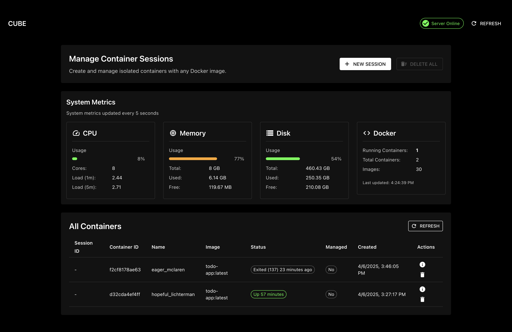

# Cube: Container Management System



A powerful container management system that provides container orchestration, metrics monitoring, and resource management through a clean REST API. The system includes an optional modern React-based UI for visual management.

## Core Features

- Container lifecycle management
- Real-time system and container metrics
- Dynamic port allocation and management
- RESTful API for all operations
- Multi-tenant support
- Resource monitoring and management

## Project Structure

```
.
├── cube-core/                 # Core Go service for container management
│   ├── cmd/                   # Command line entrypoints
│   │   └── main.go            # Main application entry point
│   ├── go.mod                 # Go module definition
│   ├── go.sum                 # Go dependencies checksum
│   ├── internal/              # Internal packages
│   │   ├── config/            # Configuration management
│   │   ├── handler/           # API handlers
│   │   ├── model/             # Data models
│   │   └── service/           # Business logic
│   ├── pkg/                   # Reusable packages
│   │   ├── docker/            # Docker management
│   │   ├── port/              # Port allocation
│   │   └── util/              # Utility functions
│   └── server.log             # Server logs
│
└── cube-ui/                   # Optional React UI for visual management
    ├── package.json           # NPM package definition
    ├── package-lock.json      # NPM dependencies lock file
    ├── public/                # Static assets
    └── src/                   # React components
        ├── App.js             # Main React application
        ├── components/        # UI components
        │   ├── SystemMetrics/ # System resource monitoring
        │   └── AllContainers/ # Docker container management
        ├── hooks/             # React Query hooks
        ├── index.js           # React entry point
        └── services/          # API service clients
```

## Components

### 1. Cube Core (Go Service)

The heart of the system, providing:

- Container lifecycle management
- Dynamic port allocation
- System metrics collection and monitoring
- Docker container orchestration
- RESTful API for all operations
- Multi-tenant isolation

### 2. Cube UI (Optional)

A modern React-based UI that provides:

- Visual container management interface
- Real-time system metrics monitoring:
  - CPU usage
  - Memory utilization
  - Disk usage
  - Docker container stats
- Container operations:
  - List all containers (managed and unmanaged)
  - Container metrics and details
  - Container lifecycle control

## API Endpoints

The core of Cube is its REST API:

### Container Management

- `GET /containers` - List all Docker containers
- `DELETE /containers/{id}` - Delete a specific container
- `POST /containers` - Create a new container

### Session Management

- `POST /sessions` - Create a new managed session
- `GET /sessions` - List all managed sessions
- `DELETE /sessions/{id}` - Delete a specific session
- `DELETE /sessions` - Delete all sessions

### Metrics

- `GET /metrics/system` - Get system-wide metrics
- `GET /metrics/containers/{id}` - Get metrics for a specific container

## Getting Started

### Prerequisites

- Docker
- Go 1.16+
- Node.js 14+ (for UI only)
- npm 6+ (for UI only)

### Setup Core Service

```bash
cd cube-core
go run cmd/main.go
```

### Setup UI (Optional)

```bash
cd cube-ui
npm install
npm start
```

Access the UI at http://localhost:3000

## Use Cases

- Container Orchestration: Manage Docker containers with a clean API
- Development Environments: Create isolated container instances
- Resource Monitoring: Track system and container resource usage
- Multi-tenant Applications: Manage isolated container instances for different users
- CI/CD Environments: Programmatically manage containers for testing
- Demo Environments: Spin up isolated instances for demonstrations

## Integration

Cube can be integrated into any system through its REST API. The API is designed to be:

- RESTful
- Stateless
- Secure
- Scalable
- Well-documented

Example integrations:

- CI/CD pipelines
- Development tools
- Testing frameworks
- Custom management UIs
- Monitoring systems

```

```
